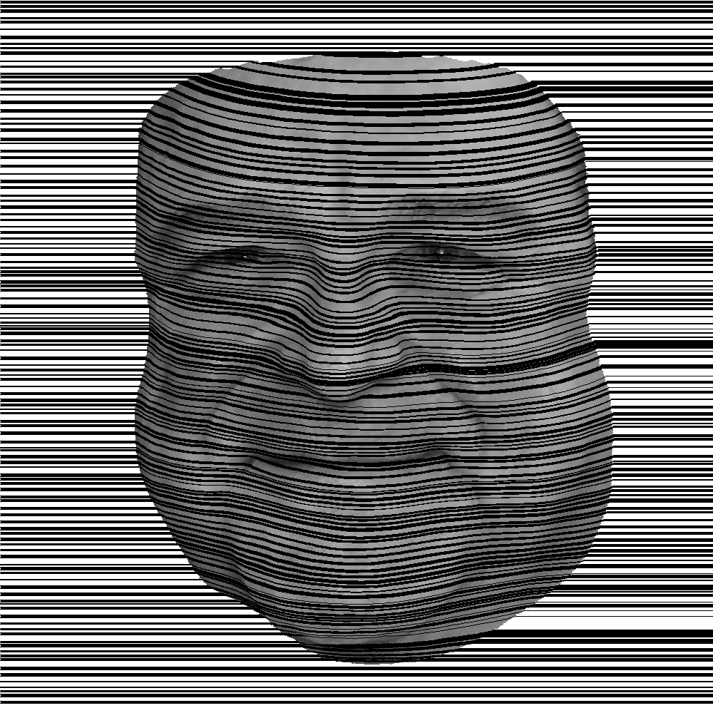
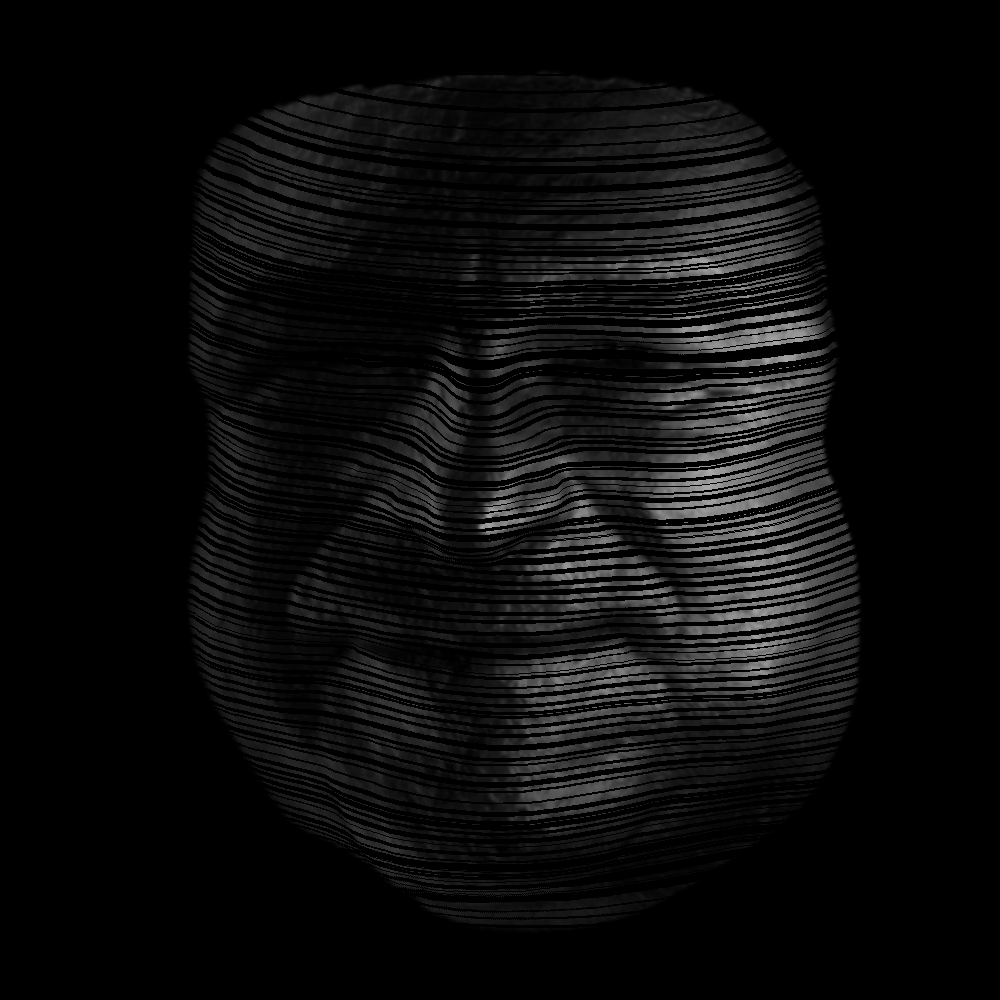

# Face-Potriat

There is a Saying "**You Dont take a Photograph you make it" and here it is...** <br>

Face-Potrait is an attempt to create Art using Code(AAS - Art As Code).This repository uses of algorithms from Image Processing, Voxelisation, 3D Mathematics and what not.

## Base Image

 

### No Shadder Effect

 

### With Background Intensity High And Shadder Effect


### With Background Intesity Low And Shadder Effect




### To Run the code.
 ``` 
 python FacePotraitMain.py
```

### Dependencies

* Plotly
* cv2 
* scipy

### Input

FacePotraitMain.py script pick up input from resource directory. Input files are basically triangulated representation of 3D Surface. Input Files include Texture, Vertexes and Faces of the Surface.

Follow the Link below to reconstruct a Face.
https://github.com/matansel/pix2vertex


 
